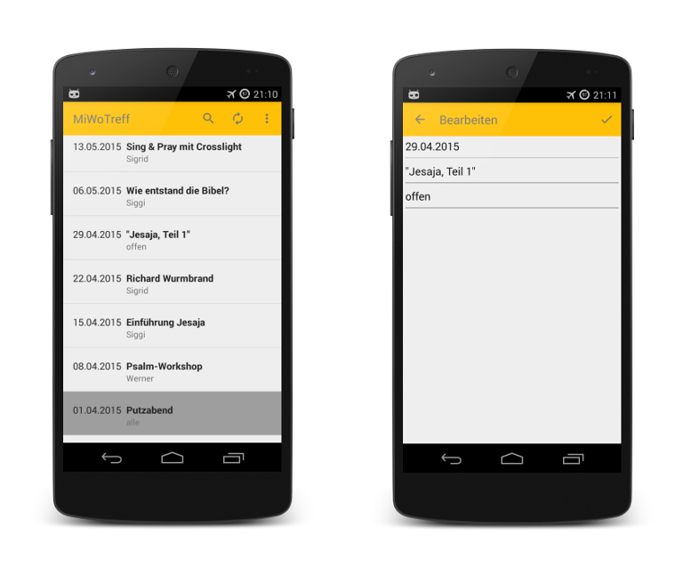

# MiWoTreff

## About

This GitHub repository hosts the code of the Android app _MiWoTreff_. _MiWoTreff_ shows the schedule of the weekly meetings of the evangelic community of Bogenhausen, Munich.

Dieses GitHub Repository hostet den Code der Android-App _MiWoTreff_. _MiWoTreff_ zeigt das Programm des "Mittwochstreff der Evangelischen Gemeinschaft Bogenhausen, München".

## Screenshots

## Compatibility

This app is compatible from sdk version 14 (Android 4.0) upward and needs the following libraries to compile:

  * appcompat-v7 library
  * design library
  * recyclerview library
  * [grant by Anthony Restaino](https://github.com/anthonycr/Grant)
  * [ion by Koushik Dutta] (https://github.com/koush/ion)

Die App ist kompatibel ab SDK Version 14 (Android 4.0) aufwärts und braucht folgende Libraries zum Kompilieren:

  * appcompat-v7 library
  * design library
  * recyclerview library
  * [grant von Anthony Restaino](https://github.com/anthonycr/Grant)
  * [ion von Koushik Dutta] (https://github.com/koush/ion)

## License

**Copyright 2018 by MicMun**

This program is free software: you can redistribute it and/or modify it under the terms of the GNU
General Public License as published by the Free Software Foundation, either version 3 of the License, or
(at your option) any later version.
This program is distributed in the hope that it will be useful, but WITHOUT ANY WARRANTY;
without even the implied warranty of MERCHANTABILITY or FITNESS FOR A PARTICULAR PURPOSE.
See the GNU General Public License for more details.
You should have received a copy of the GNU General Public License along with this program. If not, see
[http://www.gnu.org/licenses/](http://www.gnu.org/licenses/).
